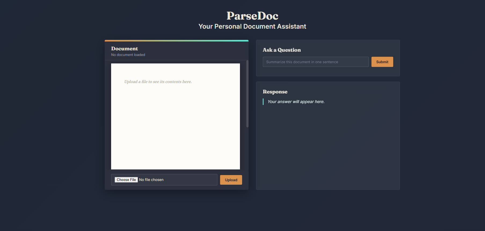
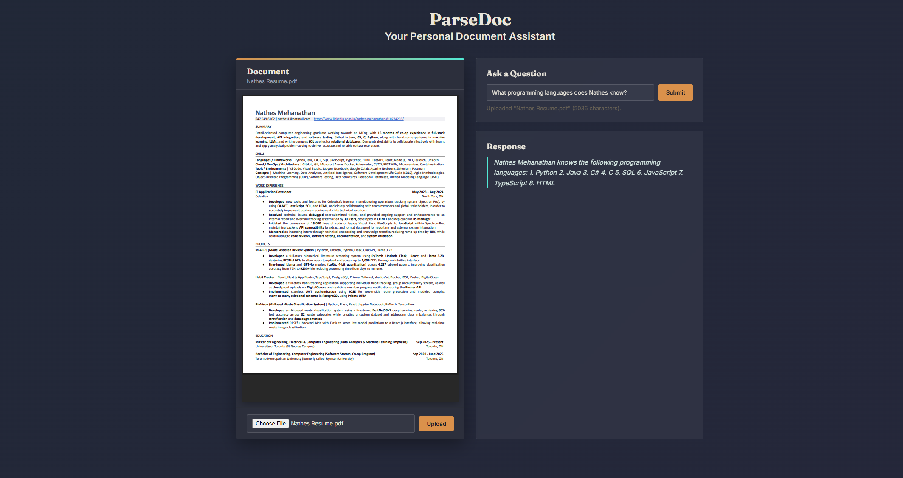

# ParseDoc

## Summary

ParseDoc is a Retrieval Augmented Generation based personal document assistant. The way it works is a user uploads a PDF, DOCX, or TXT document, and it uses RAG by splitting the document into chunks with a slight overlap, each chunk then gets embedded into a vector, and then uses cosine similarity to retrieve the most relevant chunks to the user's question and pass it to the Ollama model as context.

## Features
- Allows users to upload PDF, DOCX, and TXT documents
- Contains a live document preview with native PDF rendering in-browser for PDF documents, and a formatted reading view for TXT/DOCX documents
- Allows users to ask questions about the documents
- Has a RAG pipeline which works as follows: chunking -> local embeddings -> cosine similarity retrieval -> generation of answer
- Fully local to the user's machine

## Architecture
```
Browser (HTML / CSS / JavaScript)
        |
        v
FastAPI Backend  ---->  Ollama (Chat Model: Llama 3.2)
        |         ---->  Ollama (Embedding Model: Nomic-Embed-Text)
        v
In-Memory Document + Vector Store
```

Upload Flow: file -> text extraction -> chunking (500 words per chunk with 50 word over-lap between chunks) - > embedding each chunk -> store embeddings in memory alongside raw text

Query Flow: question -> embedded -> cosine similarity comparison against stored chunks -> top 3 similar chunks selected -> chunks sent to Ollama along with the question -> response returned

## Techstack
- Backend: Python, FastAPI, Uvicorn
- Frontend: Vanilla HTML / CSS / JavaScript
- LLM / Embeddings: Ollama (Llama 3.2 for generation, Nomic-Embed-Text for embeddings)
- Document parsing: pypdf, python-docx
- Similarity Search: Numpy (Cosine Similarity)

## Screenshot
Landing page:


After Uploading Document:



## Local Setup Instructions

Prerequisites: Python 3.10+, Ollama (https://ollama.com) Installed


Bash:
```
ollama pull llama3.2
ollama pull nomic-embed-text
```

Clone Repo:
```
git clone https://github.com/NathesMehan/parsedoc.git
cd parsedoc
```

Setup Python Envirionment:
```
python -m venv venv
venv\Scripts\activate      # Windows
source venv/bin/activate   # macOS/Linux

pip install -r requirements.txt
```

Start Backend:
```
uvicorn backend.main:app --reload
```


Open frontend/index.html directly in browser and ensure Ollama is running in the background